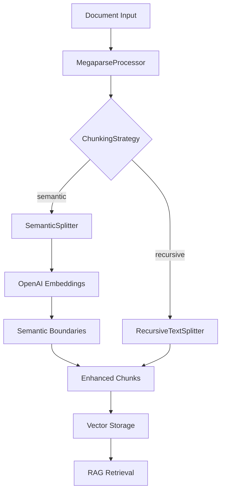
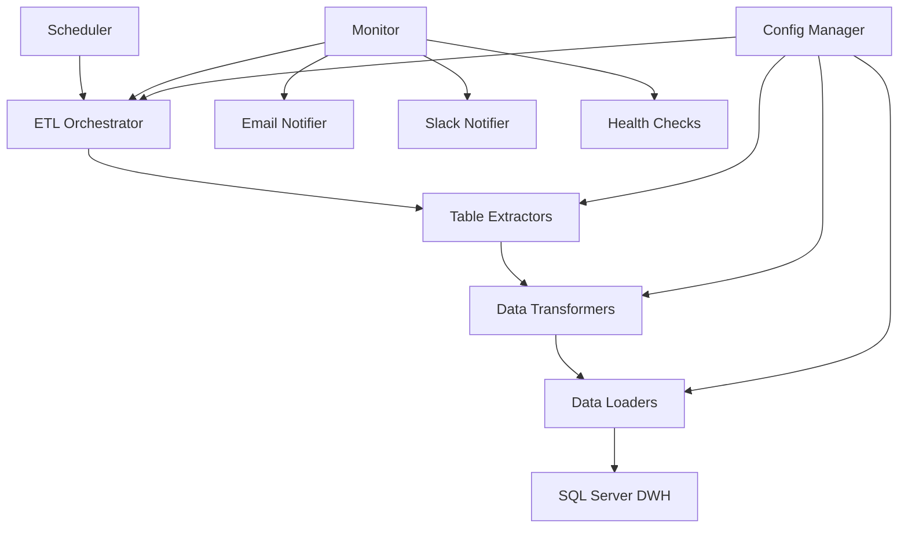
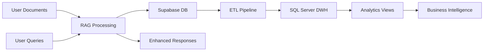

# System Patterns - Quivr Architecture Design

## Core Design Patterns

### 1. Plugin Architecture Pattern (RAG Enhancement)

The semantic chunking system uses a plugin architecture where different splitters can be dynamically selected:

```python
# Configurable splitter selection
class MegaparseProcessor:
    def __init__(self, splitter_config: SplitterConfig):
        if splitter_config.chunking_strategy == "semantic":
            self.splitter = SemanticSplitter(splitter_config)
        else:
            self.splitter = RecursiveCharacterTextSplitter(splitter_config)
```

**Benefits**:
- Easy to add new chunking strategies
- Backwards compatibility maintained
- Runtime configuration flexibility
- Clean separation of concerns

### 2. Strategy Pattern (ETL Data Processing)

Different sync strategies are implemented based on table characteristics:

```python
class TableExtractor:
    def get_sync_strategy(self, table_name: str) -> SyncStrategy:
        if table_name in self.incremental_tables:
            return IncrementalSyncStrategy()
        else:
            return FullSyncStrategy()
```

**Strategy Types**:
- **Incremental Sync**: For high-frequency tables (chat_history, notifications)
- **Full Sync**: For reference tables (users, brains, prompts)
- **Relationship Sync**: For many-to-many mappings

### 3. Factory Pattern (Database Connections)

Database connections are created through factories for different database types:

```python
class DatabaseFactory:
    @staticmethod
    def create_source_db() -> SupabaseConnection:
        return SupabaseConnection(config.SUPABASE_URL)
    
    @staticmethod
    def create_target_db() -> SQLServerConnection:
        return SQLServerConnection(config.SQLSERVER_URL)
```

**Benefits**:
- Consistent connection management
- Easy to add new database types
- Connection pooling abstraction
- Configuration encapsulation

### 4. Observer Pattern (Monitoring & Alerting)

ETL monitoring uses observer pattern for notifications:

```python
class ETLMonitor:
    def __init__(self):
        self.observers = [EmailNotifier(), SlackNotifier(), LoggingObserver()]
    
    def notify_completion(self, metrics: ETLMetrics):
        for observer in self.observers:
            observer.handle_event(metrics)
```

**Observer Types**:
- **EmailNotifier**: Sends completion/error emails
- **SlackNotifier**: Posts to Slack channels
- **LoggingObserver**: Structured logging
- **HealthCheckObserver**: Updates health endpoints

### 5. Chain of Responsibility (RAG Processing)

Document processing follows a chain of responsibility:

```
Document Input → Metadata Extractor → Content Parser → Semantic Splitter → Vector Generator → Storage
```

Each handler in the chain:
- Processes its specific aspect
- Passes enriched data to next handler
- Can short-circuit on errors
- Maintains processing context

### 6. Repository Pattern (Data Access)

Both systems use repository pattern for data access:

```python
class ChatRepository:
    def get_by_timerange(self, start: datetime, end: datetime) -> List[Chat]:
        # Implementation abstracted from business logic
        
class BrainRepository:
    def get_active_brains(self) -> List[Brain]:
        # Database specifics hidden from consumers
```

**Benefits**:
- Database agnostic business logic
- Easy testing with mock repositories
- Clean separation of data access
- Consistent error handling

## Architectural Decisions

### 1. Microservices vs Monolith Decision

**Decision**: Hybrid approach with separate ETL service but integrated RAG enhancement

**Reasoning**:
- RAG enhancement integrates tightly with existing Quivr core
- ETL pipeline operates independently with different lifecycle
- Allows independent scaling and deployment
- Reduces coupling between analytics and user-facing features

### 2. Database Choice for Data Warehouse

**Decision**: SQL Server over PostgreSQL for analytics

**Reasoning**:
- Better BI tool integration (Power BI, SSRS)
- Strong analytics and reporting features
- Familiar to business users
- Excellent indexing for analytical queries
- Enterprise support and tooling

### 3. Synchronous vs Asynchronous ETL

**Decision**: Asynchronous processing with scheduled jobs

**Reasoning**:
- Doesn't impact user-facing application performance
- Allows batch optimization for efficiency
- Easier error handling and recovery
- Configurable scheduling based on business needs

### 4. Embedding Strategy for Semantic Chunking

**Decision**: External API (OpenAI) with local fallback

**Reasoning**:
- High-quality embeddings without local GPU requirements
- Fallback to recursive chunking ensures reliability
- Cost-effective for most use cases
- Easy to switch providers if needed

### 5. Configuration Management Pattern

**Decision**: Environment-based configuration with Pydantic validation

**Reasoning**:
- Type safety and validation at startup
- Easy deployment across environments
- Clear documentation of required settings
- Prevents runtime configuration errors

## Component Relationships

### 1. RAG Enhancement Components



### 2. ETL Pipeline Components



### 3. Data Flow Architecture



## Error Handling Patterns

### 1. Circuit Breaker Pattern (External APIs)

```python
class OpenAIEmbeddingService:
    def __init__(self):
        self.circuit_breaker = CircuitBreaker(
            failure_threshold=5,
            recovery_timeout=60
        )
    
    def get_embeddings(self, texts: List[str]) -> Optional[List[float]]:
        return self.circuit_breaker.call(self._api_call, texts)
```

### 2. Retry with Exponential Backoff

```python
@retry(
    stop=stop_after_attempt(3),
    wait=wait_exponential(multiplier=1, min=4, max=10)
)
def sync_table_data(self, table_name: str):
    # ETL processing with automatic retry
```

### 3. Graceful Degradation

- **Semantic Chunking**: Falls back to recursive chunking if embeddings fail
- **ETL Pipeline**: Continues with other tables if one fails
- **Monitoring**: Continues operation even if notifications fail

## Performance Patterns

### 1. Batch Processing

```python
class BatchProcessor:
    def process_in_batches(self, items: List[Any], batch_size: int = 1000):
        for i in range(0, len(items), batch_size):
            batch = items[i:i + batch_size]
            self.process_batch(batch)
```

### 2. Connection Pooling

```python
class DatabaseManager:
    def __init__(self):
        self.pool = create_engine(
            url,
            pool_size=10,
            max_overflow=20,
            pool_pre_ping=True
        )
```

### 3. Lazy Loading

```python
class DocumentProcessor:
    @cached_property
    def embeddings_service(self):
        return OpenAIEmbeddingService()  # Only created when needed
```

## Security Patterns

### 1. Data Sanitization Pattern

```python
class DataSanitizer:
    SENSITIVE_FIELDS = ['api_key', 'password', 'embedding']
    
    def sanitize_record(self, record: Dict) -> Dict:
        return {k: v for k, v in record.items() 
                if k not in self.SENSITIVE_FIELDS}
```

### 2. Configuration Security

```python
class SecureConfig:
    def __init__(self):
        self.api_key = os.getenv('OPENAI_API_KEY')
        if not self.api_key:
            raise ConfigurationError("API key required")
```

### 3. Network Isolation

- ETL services run in isolated Docker networks
- Database connections use internal container names
- External access only through defined ports

## Testing Patterns

### 1. Repository Mock Pattern

```python
class MockChatRepository:
    def __init__(self, test_data: List[Chat]):
        self.data = test_data
    
    def get_by_timerange(self, start: datetime, end: datetime) -> List[Chat]:
        return [chat for chat in self.data 
                if start <= chat.created_at <= end]
```

### 2. Integration Test Pattern

```python
class ETLIntegrationTest:
    def setUp(self):
        self.test_db = create_test_database()
        self.etl_service = ETLService(test_config)
    
    def test_full_sync_workflow(self):
        # Test complete ETL workflow with real database
```

### 3. Configuration Test Pattern

```python
def test_config_validation():
    with pytest.raises(ValidationError):
        Config(SUPABASE_URL="invalid_url")
```

## Monitoring Patterns

### 1. Health Check Pattern

```python
class HealthChecker:
    def check_system_health(self) -> HealthStatus:
        checks = [
            self.check_database_connection(),
            self.check_api_availability(),
            self.check_disk_space()
        ]
        return HealthStatus.from_checks(checks)
```

### 2. Metrics Collection Pattern

```python
class MetricsCollector:
    def record_processing_time(self, operation: str, duration: float):
        self.metrics[f"{operation}_duration"].append(duration)
    
    def record_error(self, operation: str, error_type: str):
        self.metrics[f"{operation}_errors"][error_type] += 1
```

### 3. Alerting Pattern

```python
class AlertManager:
    def trigger_alert(self, level: AlertLevel, message: str):
        for handler in self.alert_handlers[level]:
            handler.send_alert(message)
```

These patterns provide a robust foundation for both the RAG enhancement and ETL systems, ensuring maintainability, scalability, and reliability while following established software engineering best practices. 